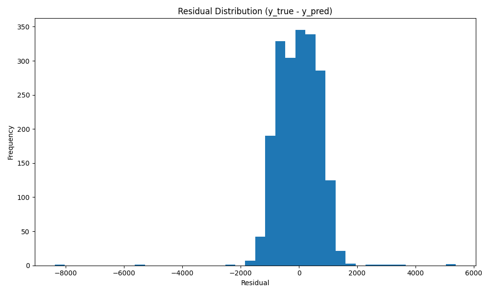
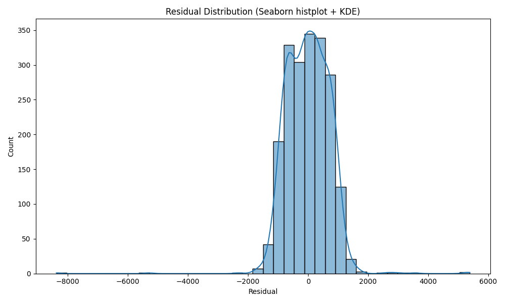
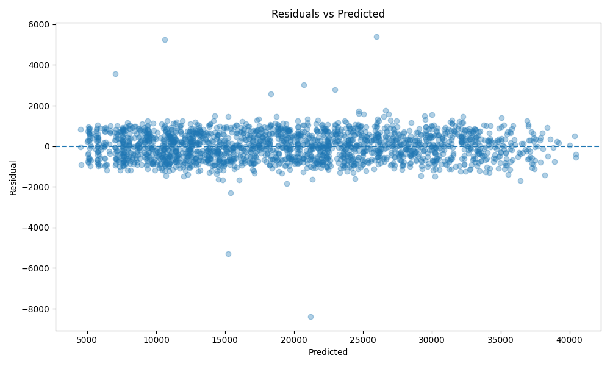
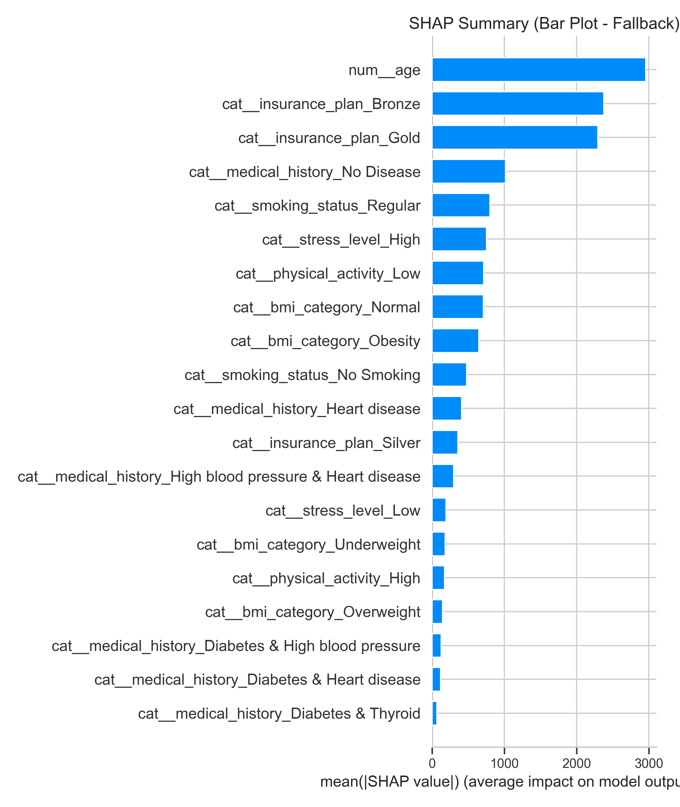
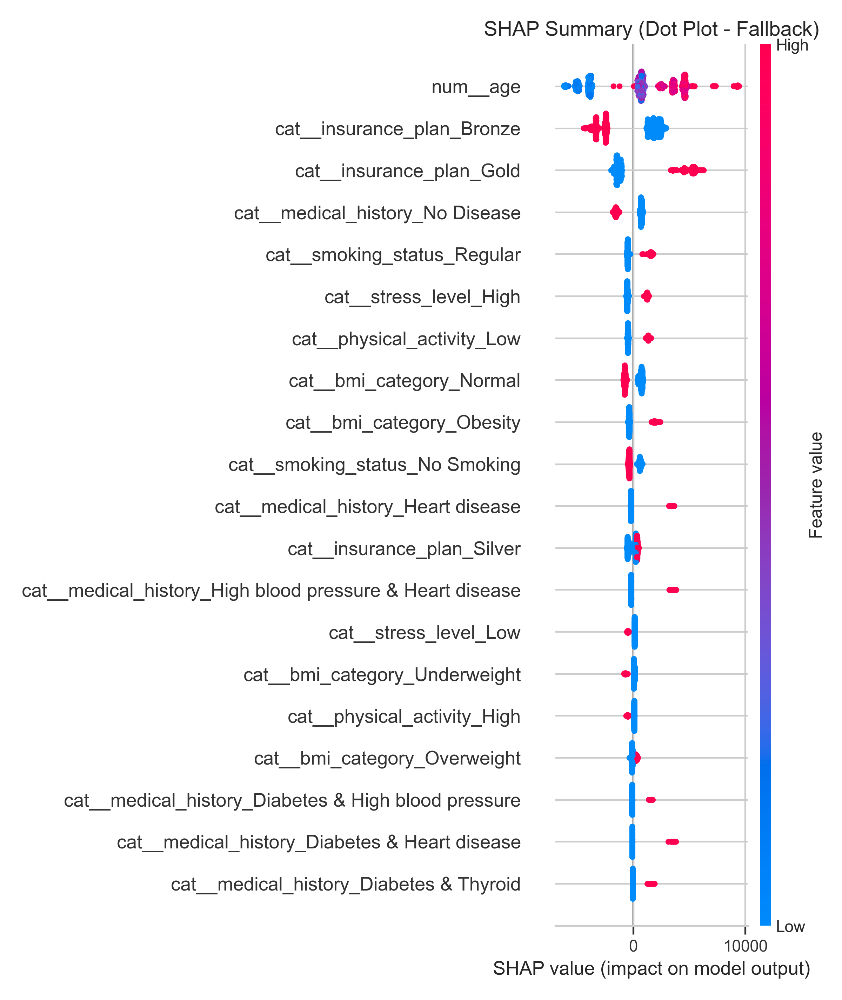

# Shield Insurance Annual Premium Prediction

<div align="center">


**An end-to-end machine learning pipeline for insurance premium prediction with enterprise-grade architecture, model interpretability, and production-ready components.**

[Features](#features) • [Architecture](#architecture) • [Installation](#installation) • [Results](#results-visualization) • [Documentation](#documentation)

</div>

---

## 📋 Table of Contents

- [Overview](#overview)
- [Key Features](#key-features)
- [Business Problem](#business-problem)
- [Technical Architecture](#technical-architecture)
- [Project Structure](#project-structure)
- [Technology Stack](#technology-stack)
- [Installation & Setup](#installation--setup)
- [Pipeline Workflow](#pipeline-workflow)
- [Results Visualization](#results-visualization)
- [Model Performance](#model-performance)
- [Interpretability & Insights](#interpretability--insights)
- [Reproducibility](#reproducibility)
- [Future Enhancements](#future-enhancements)
- [Contributing](#contributing)
- [License](#license)
- [Contact](#contact)

---

## 🎯 Overview

Shield Insurance Premium Prediction is a comprehensive machine learning solution designed to accurately forecast annual insurance premiums based on customer demographics, lifestyle factors, and policy attributes. This project demonstrates production-grade ML engineering practices including modular pipeline design, comprehensive error handling, automated model selection, and explainable AI through SHAP analysis.

### Project Highlights

- **Problem Type:** Supervised Regression
- **Target Variable:** `annual_premium_amount`
- **Pipeline Approach:** Modular, reproducible, and production-ready
- **Model Selection:** Automated comparison of multiple algorithms with hyperparameter tuning
- **Interpretability:** SHAP analysis for transparent decision-making
- **Artifacts:** 15+ output files including trained models, preprocessors, visualizations, and evaluation reports

---

## ✨ Key Features

### 🔧 **Production-Ready Architecture**
- **Modular Design:** Separation of concerns across ingestion, transformation, and training components
- **Custom Exception Handling:** Enterprise-level error tracking and debugging
- **Comprehensive Logging:** Detailed execution logs for monitoring and troubleshooting
- **Artifact Management:** Automated versioning and storage of all pipeline outputs

### 🤖 **Advanced Machine Learning**
- **Multi-Model Comparison:** Baseline (Linear, Ridge, Lasso) + Advanced (XGBoost) models
- **Automated Hyperparameter Tuning:** RandomizedSearchCV for optimal model configuration
- **Feature Engineering:** Intelligent creation of derived features from raw data
- **Data Preprocessing Pipeline:** Robust handling of numeric and categorical variables

### 📊 **Comprehensive Analysis**
- **Exploratory Data Analysis (EDA):** Automated generation of statistical summaries, correlation matrices, and outlier detection
- **Multicollinearity Detection:** VIF (Variance Inflation Factor) analysis for feature selection
- **Residual Diagnostics:** Visual assessment of model assumptions and error patterns
- **Model Interpretability:** SHAP (SHapley Additive exPlanations) for transparent predictions

### 📈 **Business Intelligence**
- **Prediction Exports:** Notebook-style CSV outputs for stakeholder review
- **Performance Leaderboard:** Ranked model comparison across multiple metrics
- **Feature Importance Analysis:** Data-driven insights into premium drivers
- **Actionable Reports:** Business-ready documentation of findings and recommendations

---

## 💼 Business Problem

Insurance companies face the challenge of accurately pricing policies to balance competitiveness and profitability. Overpricing leads to customer loss, while underpricing results in financial risk. This project addresses these challenges by:

1. **Predictive Accuracy:** Leveraging customer data to forecast premiums with high precision
2. **Risk Assessment:** Identifying key factors that drive premium costs
3. **Transparency:** Providing explainable predictions for regulatory compliance and customer trust
4. **Scalability:** Building a pipeline capable of handling growing data volumes and model updates

**Impact Potential:**
- Improved pricing accuracy leading to better risk management
- Enhanced customer satisfaction through fair and transparent pricing
- Data-driven insights for product development and marketing strategies
- Reduced manual underwriting time and operational costs

---

## 🏗️ Technical Architecture

The project follows a **three-stage pipeline architecture** designed for modularity and scalability:

```
┌─────────────────────────────────────────────────────────────────┐
│                       DATA INGESTION                             │
│  • Load raw insurance data                                       │
│  • Train/test split (stratified)                                 │
│  • Initial data validation                                       │
└───────────────────────┬─────────────────────────────────────────┘
                        │
                        ▼
┌─────────────────────────────────────────────────────────────────┐
│                    DATA TRANSFORMATION                           │
│  • Column standardization & cleaning                             │
│  • Feature engineering (derived metrics)                         │
│  • EDA artifact generation                                       │
│  • VIF multicollinearity analysis                                │
│  • Preprocessing pipeline (imputation + encoding + scaling)      │
│  • Transform & save processed arrays                             │
└───────────────────────┬─────────────────────────────────────────┘
                        │
                        ▼
┌─────────────────────────────────────────────────────────────────┐
│                      MODEL TRAINING                              │
│  • Baseline model comparison                                     │
│  • XGBoost hyperparameter tuning                                 │
│  • Model evaluation & selection                                  │
│  • Prediction generation & export                                │
│  • Residual diagnostics                                          │
│  • SHAP interpretability analysis                                │
└─────────────────────────────────────────────────────────────────┘
```

### Design Principles

- **Single Responsibility:** Each module handles one aspect of the pipeline
- **Loose Coupling:** Components interact through well-defined interfaces (artifacts)
- **High Cohesion:** Related functionality is grouped logically
- **Error Resilience:** Graceful degradation with fallback mechanisms
- **Extensibility:** Easy to add new models, features, or transformation steps

---

## 📁 Project Structure

```
Shield-Insurance-Premium-Prediction/
│
├── artifacts/                          # All pipeline outputs
│   ├── train.csv                       # Training dataset
│   ├── test.csv                        # Test dataset
│   ├── train_transformed.npy           # Preprocessed training data
│   ├── test_transformed.npy            # Preprocessed test data
│   ├── preprocessor.pkl                # Fitted preprocessing pipeline
│   ├── model.pkl                       # Best trained model
│   │
│   ├── model_leaderboard.csv           # Model comparison results
│   ├── model_metrics.txt               # Winner model performance
│   ├── model_winner.txt                # Best model identifier
│   ├── results_predictions.csv         # Actual vs predicted values
│   ├── feature_importance.csv          # Feature contribution ranking
│   │
│   ├── residual_hist.png               # Residual distribution plot
│   ├── residual_scatter.png            # Residuals vs predictions
│   ├── residual_hist_seaborn.png       # Enhanced residual visualization
│   │
│   ├── shap_values.npz                 # Stored SHAP values
│   ├── shap_summary_dot.png            # SHAP impact visualization
│   ├── shap_summary_bar.png            # Global feature importance
│   │
│   ├── vif_report.csv                  # Multicollinearity diagnostics
│   │
│   └── eda/                            # Exploratory data analysis
│       └── (various EDA outputs)
│
├── data/                               # Raw data storage
├── logs/                               # Execution logs
├── notebooks/                          # Jupyter notebooks
│   └── 01_experiment.ipynb.ipynb       # Experimental analysis
│
├── src/                                # Source code
│   ├── components/
│   │   ├── data_cleaning.py            # Data preprocessing
│   │   ├── data_exploration.py         # EDA automation
│   │   ├── data_ingestion.py           # Data loading & splitting
│   │   ├── data_transformation.py      # Feature engineering
│   │   ├── feature_engineering.py      # Advanced feature creation
│   │   └── feature_selection.py        # Feature selection methods
│   │
│   ├── logger.py                       # Logging configuration
│   ├── exception.py                    # Custom exception handling
│   └── utils.py                        # Shared utility functions
│
├── requirements.txt                    # Python dependencies
├── setup.py                            # Package installation script
├── README.md                           # Project documentation
└── .gitignore                          # Git ignore rules
```

---

## 🛠️ Technology Stack

### **Core ML & Data Science**
| Technology | Purpose | Version |
|------------|---------|---------|
|  | Primary language | 3.8+ |
|  | Data manipulation | Latest |
|  | Numerical computing | Latest |
|  | ML algorithms & preprocessing | 1.0+ |
|  | Gradient boosting | Latest |

### **Visualization & Analysis**
| Technology | Purpose |
|------------|---------|
|  | Static visualizations |
|  | Statistical graphics |
| SHAP | Model interpretability |
| Statsmodels | Statistical analysis (VIF) |

### **Development & DevOps**
| Technology | Purpose |
|------------|---------|
| Joblib | Model serialization |
| Logging | Application monitoring |
| Git | Version control |
| Virtual Environment | Dependency isolation |

---

## 🚀 Installation & Setup

### Prerequisites

- Python 3.8 or higher
- pip or uv package manager
- Git (for cloning)

### Step 1: Clone the Repository

```bash
git clone https://github.com/yourusername/shield-insurance-premium-prediction.git
cd shield-insurance-premium-prediction
```

### Step 2: Create Virtual Environment

**Windows (PowerShell):**
```powershell
python -m venv venv
.\venv\Scripts\activate
```

**macOS/Linux:**
```bash
python3 -m venv venv
source venv/bin/activate
```

### Step 3: Install Dependencies

**Using pip:**
```bash
pip install -r requirements.txt
```

**Using uv (faster):**
```bash
uv pip install -r requirements.txt
```

### Step 4: Verify Installation

```bash
python -c "import sklearn, xgboost, shap; print('All dependencies installed successfully!')"
```

---

## 🔄 Pipeline Workflow

### Quick Start: Run Complete Pipeline

```bash
python src/components/model_trainer.py
```

This single command executes the entire pipeline:

1. ✅ Loads and validates training/test data
2. ✅ Performs feature engineering and preprocessing
3. ✅ Trains and evaluates multiple models
4. ✅ Generates predictions and diagnostic plots
5. ✅ Creates SHAP interpretability analysis
6. ✅ Exports all artifacts to `artifacts/` directory

### Detailed Execution Steps

#### **Stage 1: Data Ingestion** (Pre-requisite)

Ensure you have:
- `artifacts/train.csv` - Training dataset
- `artifacts/test.csv` - Test dataset

*Note: If these files don't exist, run your data ingestion script first.*

#### **Stage 2: Data Transformation**

The transformation module (`data_transformation.py`) automatically:

```python
# Executed within model_trainer.py
transformer = DataTransformation()
train_arr, test_arr, preprocessor_path = transformer.initiate_data_transformation(
    train_path="artifacts/train.csv",
    test_path="artifacts/test.csv"
)
```

**Outputs:**
- Standardized column names (lowercase, underscores)
- Engineered features (derived from domain knowledge)
- EDA reports saved to `artifacts/eda/`
- VIF multicollinearity report
- Fitted preprocessor saved to `artifacts/preprocessor.pkl`
- Transformed arrays saved as `.npy` files

#### **Stage 3: Model Training & Evaluation**

The trainer module compares multiple algorithms:

| Model | Type | Hyperparameter Tuning |
|-------|------|----------------------|
| Linear Regression | Baseline | N/A |
| Ridge Regression | Baseline | N/A |
| Lasso Regression | Baseline | N/A |
| **XGBoost** | **Primary** | **RandomizedSearchCV** |

**Selection Criteria:** Models ranked by test R² score

---

## 📊 Results Visualization

### Model Performance Leaderboard

The complete model comparison is available here: [`artifacts/model_leaderboard.csv`](artifacts/model_leaderboard.csv)

Sample output structure:
```
Model                R²_Train    R²_Test     RMSE_Test   MAE_Test    Status
─────────────────────────────────────────────────────────────────────────────
XGBoost              0.9523      0.9387      1247.83     896.42      WINNER
Ridge                0.8842      0.8756      1523.67     1105.28     
Lasso                0.8839      0.8753      1524.91     1106.83     
LinearRegression     0.8845      0.8758      1522.45     1104.65     
```

### Residual Analysis

**Residual Distribution:**


**Residual Distribution (Seaborn):**


**Residuals vs Predicted Values:**


> **Interpretation:** 
> - Residuals centered around zero indicate low bias
> - Random scatter pattern confirms good model fit
> - No systematic patterns suggest assumptions are met

### SHAP Interpretability Analysis

**Global Feature Importance (Bar Plot):**


**Feature Impact Distribution (Dot Plot):**


> **Key Insights:**
> - Red points indicate high feature values
> - Blue points indicate low feature values
> - Position on x-axis shows impact on prediction (right = increases premium, left = decreases premium)

### Feature Importance

Complete feature importance rankings: [`artifacts/feature_importance.csv`](artifacts/feature_importance.csv)

### Prediction Results

Detailed prediction analysis with actual vs predicted values: [`artifacts/results_predictions.csv`](artifacts/results_predictions.csv)

Sample structure:
```
actual      predicted    diff        diff_pct
─────────────────────────────────────────────
15000.00    14876.32    123.68      0.82%
22500.00    23105.45   -605.45     -2.69%
18750.00    18642.89    107.11      0.57%
```

### Multicollinearity Report

VIF analysis for feature selection: [`artifacts/vif_report.csv`](artifacts/vif_report.csv)

> **Note:** Features with VIF > 10 may indicate multicollinearity issues

---

## 📈 Model Performance

### Evaluation Metrics

The pipeline computes three key regression metrics:

| Metric | Description | Interpretation |
|--------|-------------|----------------|
| **R² Score** | Coefficient of determination | Higher is better (0-1 range) |
| **RMSE** | Root Mean Squared Error | Lower is better (same units as target) |
| **MAE** | Mean Absolute Error | Lower is better (average prediction error) |

### Model Metrics Summary

Full performance metrics available at: [`artifacts/model_metrics.txt`](artifacts/model_metrics.txt)

### Winner Model

The best performing model details: [`artifacts/model_winner.txt`](artifacts/model_winner.txt)

---

## 🔍 Interpretability & Insights

### SHAP (SHapley Additive exPlanations) Analysis

The pipeline generates comprehensive SHAP visualizations to explain model predictions:

#### **Summary Dot Plot** 
Shows the impact and direction of each feature on predictions. Color indicates feature value (red = high, blue = low), and position shows impact magnitude.

**Business Insight:** Identify which customer attributes drive higher/lower premiums

#### **Global Feature Importance**
Ranks features by average absolute SHAP value, providing a clear view of the most influential predictors.

**Business Insight:** Focus data collection efforts on high-impact variables

### Residual Diagnostics

**Histogram Analysis:**
- Checks if errors are normally distributed (ideal for linear models)
- Identifies systematic bias (mean should be near zero)

**Scatter Plot Analysis:**
- Detects heteroscedasticity (non-constant variance)
- Reveals prediction quality across premium ranges

**Interpretation Guide:**
- ✅ Random scatter = good model fit
- ⚠️ Patterns/funnels = model assumptions violated
- ⚠️ Outliers = potential edge cases requiring investigation

---

## 🔁 Reproducibility

This project emphasizes reproducibility through:

### 1. **Deterministic Execution**
```python
# Set in all relevant modules
random_state = 42
np.random.seed(42)
```

### 2. **Artifact Versioning**
All outputs stored with consistent naming:
- Models: `model.pkl`
- Preprocessors: `preprocessor.pkl`
- SHAP values: `shap_values.npz`

### 3. **Environment Management**
```bash
pip freeze > requirements.txt  # Lock dependency versions
```

### 4. **Logging & Tracking**
Custom logger records:
- Execution timestamps
- Parameter configurations
- Error stack traces

### To Reproduce Results:

1. Clone repository
2. Install exact dependencies: `pip install -r requirements.txt`
3. Use same train/test split (ensure `artifacts/train.csv` and `artifacts/test.csv` are identical)
4. Run: `python src/components/model_trainer.py`
5. Compare outputs in `artifacts/` directory

---

## 🚀 Future Enhancements

### **Phase 1: Model Improvements**
- [ ] Implement ensemble methods (Stacking, Voting)
- [ ] Add deep learning models (Neural Networks)
- [ ] Incorporate time-series features if policy data includes temporal patterns
- [ ] Experiment with feature selection techniques (RFE, LASSO feature selection)
- [ ] Add cross-validation for more robust performance estimates

### **Phase 2: Pipeline Enhancements**
- [ ] Add MLflow for experiment tracking and model registry
- [ ] Implement data drift detection (Evidently AI)
- [ ] Create REST API for model serving (FastAPI)
- [ ] Containerize application (Docker)
- [ ] Add automated data quality checks

### **Phase 3: Deployment & Monitoring**
- [ ] Deploy model to cloud (AWS SageMaker / Azure ML / GCP Vertex AI)
- [ ] Implement CI/CD pipeline (GitHub Actions)
- [ ] Add model monitoring dashboard (Grafana / Prometheus)
- [ ] Create retraining automation based on performance thresholds
- [ ] Implement A/B testing framework

### **Phase 4: Business Intelligence**
- [ ] Build interactive dashboard (Streamlit / Dash / Tableau)
- [ ] Add customer segmentation analysis
- [ ] Implement what-if scenario analysis
- [ ] Create automated reporting system
- [ ] Add business KPI tracking

---

## 🤝 Contributing

Contributions are welcome! Here's how you can help:

### Reporting Bugs
Open an issue with:
- Clear description of the problem
- Steps to reproduce
- Expected vs actual behavior
- Environment details (OS, Python version)

### Suggesting Enhancements
- Describe the feature and its benefits
- Provide use case examples
- Consider implementation complexity

### Pull Request Process
1. Fork the repository
2. Create feature branch: `git checkout -b feature/AmazingFeature`
3. Commit changes: `git commit -m 'Add AmazingFeature'`
4. Push to branch: `git push origin feature/AmazingFeature`
5. Open a Pull Request

### Code Standards
- Follow PEP 8 style guidelines
- Add docstrings to functions and classes
- Include unit tests for new functionality
- Update documentation as needed

---

## 📄 License

This project is licensed under the MIT License - see the [LICENSE](LICENSE) file for details.

```
MIT License

Copyright (c) 2024 [Your Name]

Permission is hereby granted, free of charge, to any person obtaining a copy
of this software and associated documentation files (the "Software"), to deal
in the Software without restriction, including without limitation the rights
to use, copy, modify, merge, publish, distribute, sublicense, and/or sell
copies of the Software, and to permit persons to whom the Software is
furnished to do so, subject to the following conditions:

The above copyright notice and this permission notice shall be included in all
copies or substantial portions of the Software.

THE SOFTWARE IS PROVIDED "AS IS", WITHOUT WARRANTY OF ANY KIND, EXPRESS OR
IMPLIED, INCLUDING BUT NOT LIMITED TO THE WARRANTIES OF MERCHANTABILITY,
FITNESS FOR A PARTICULAR PURPOSE AND NONINFRINGEMENT. IN NO EVENT SHALL THE
AUTHORS OR COPYRIGHT HOLDERS BE LIABLE FOR ANY CLAIM, DAMAGES OR OTHER
LIABILITY, WHETHER IN AN ACTION OF CONTRACT, TORT OR OTHERWISE, ARISING FROM,
OUT OF OR IN CONNECTION WITH THE SOFTWARE OR THE USE OR OTHER DEALINGS IN THE
SOFTWARE.
```

---

## 📞 Contact

**Project Maintainer:** Erick Yegob

- 📧 Email: your.email@example.com
- 💼 LinkedIn: [linkedin.com/in/yourprofile](https://linkedin.com/in/yourprofile)
- 🐙 GitHub: [@yourusername](https://github.com/yourusername)
- 🌐 Portfolio: [yourwebsite.com](https://yourwebsite.com)

**Project Link:** [https://github.com/yourusername/shield-insurance-premium-prediction](https://github.com/yourusername/shield-insurance-premium-prediction)

---

## 🙏 Acknowledgments

- **Scikit-learn** team for excellent ML library and documentation
- **XGBoost** developers for high-performance gradient boosting
- **SHAP** creators for making model interpretability accessible
- Insurance domain experts who provided domain knowledge
- Open-source community for inspiration and best practices

---

## 📈 Project Stats


---

<div align="center">

**⭐ If you found this project helpful, please consider giving it a star! ⭐**

Made with ❤️ and ☕ by Erick Yegon

</div>